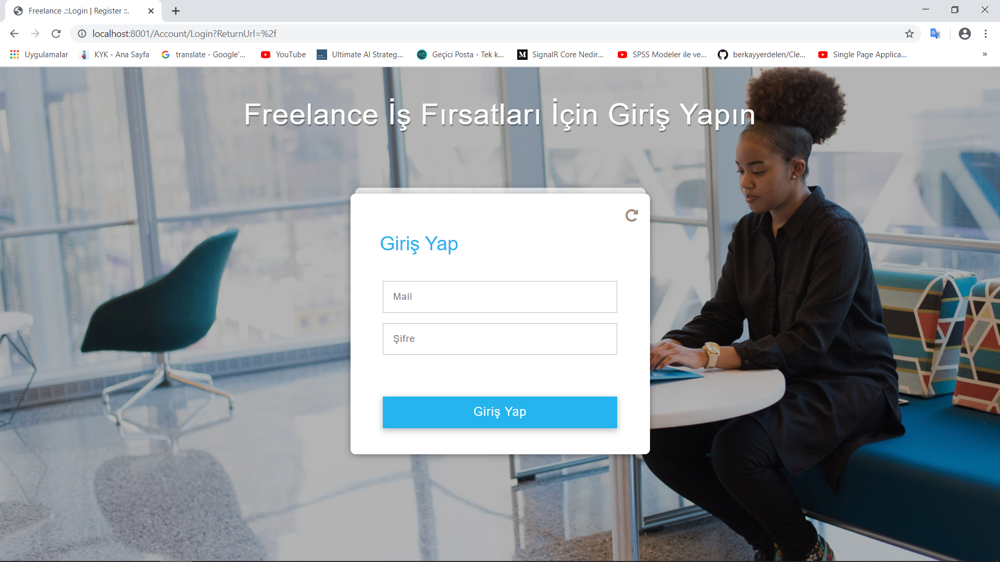
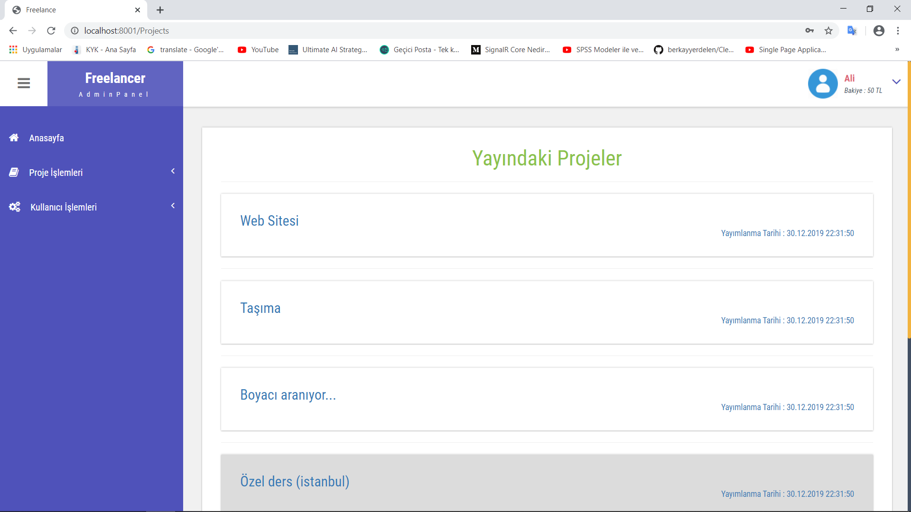
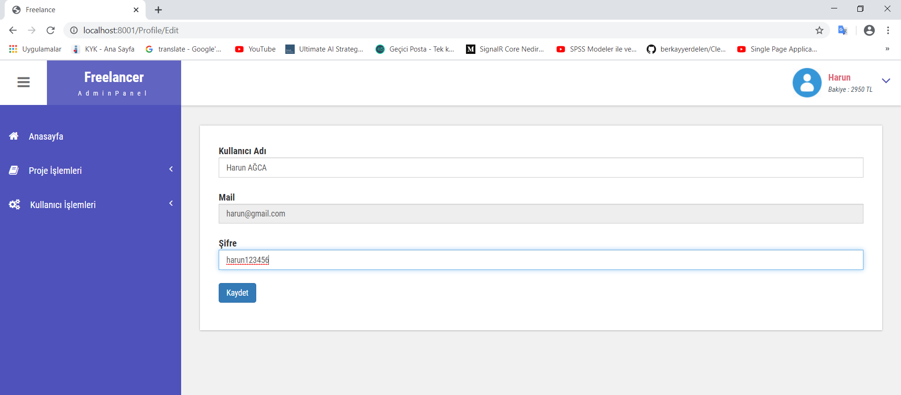
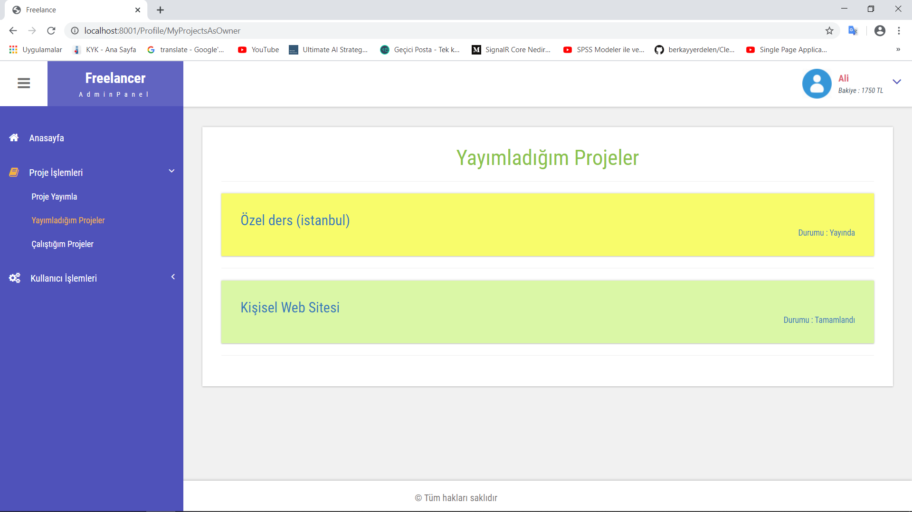
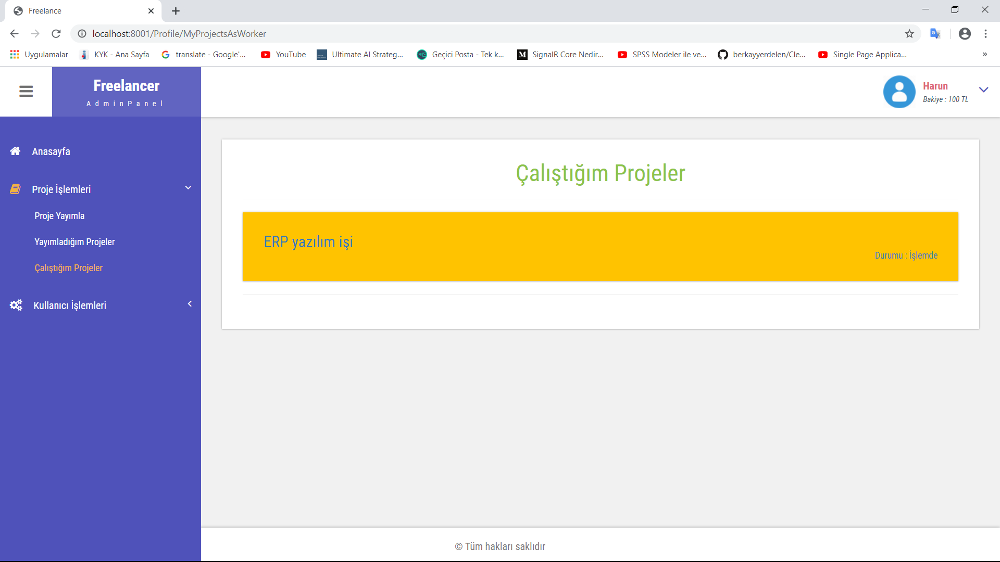
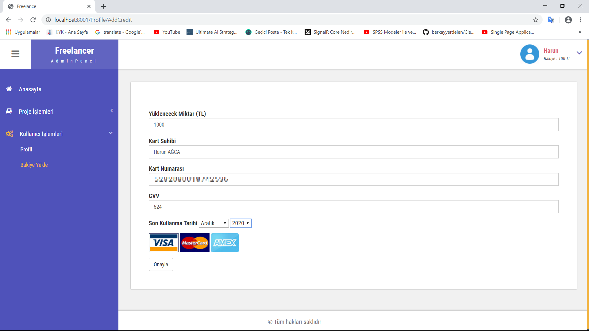
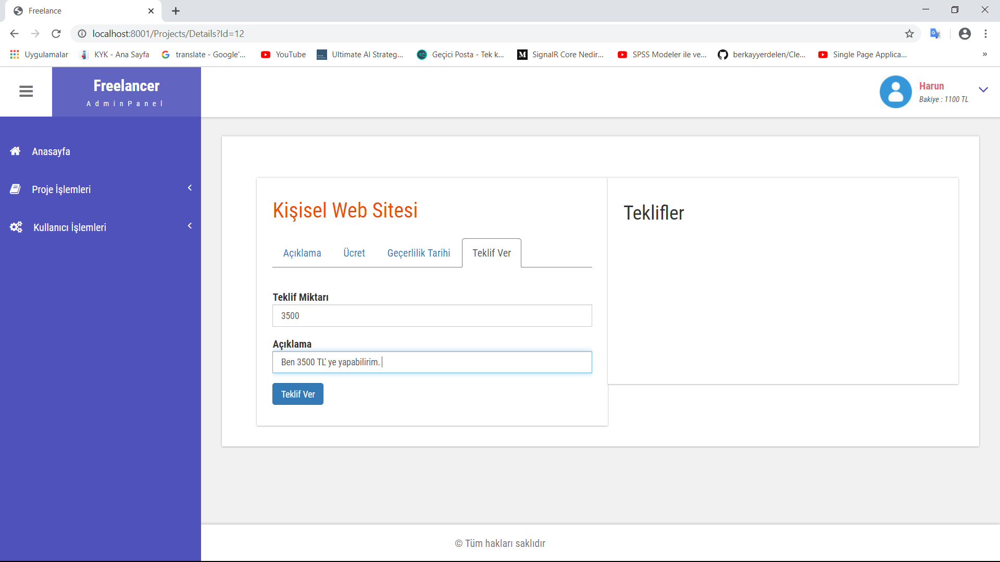
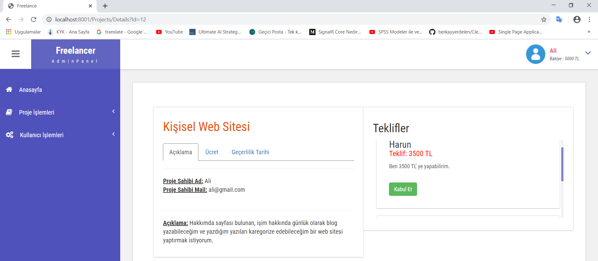
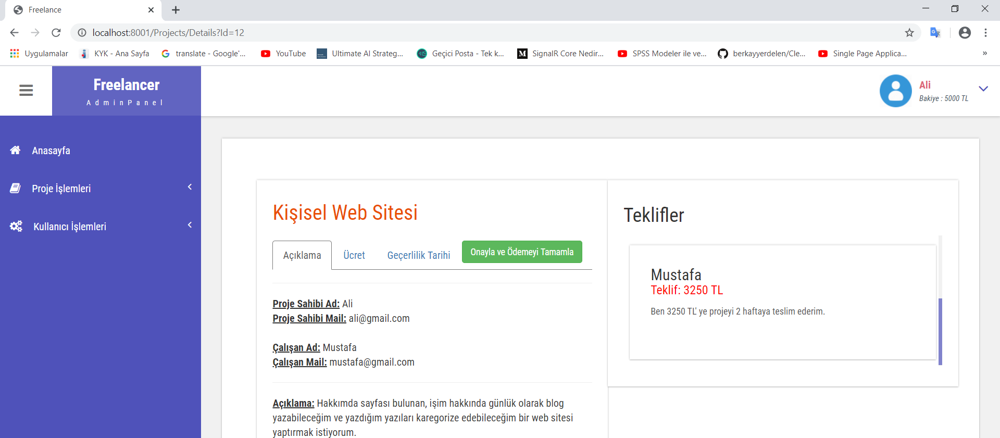

# Freelance
This repository contains codes of Freelance platform project which developed with Asp.Net MVC, and Asp.Net Web API.

# Used Tools, Programming Languages, Architectures etc.

  - ASP.NET MVC (Web UI)
  - ASP.NET WEB API (RESTful Web Service)
  - Entity Framework 
  - MS SQL Server
  - C#
  - Layered Architecture

# Screenshots

## Login - Register

## Home Page - Projects

## Edit Account Settings

## My Projects As Owner

## My Projects As Worker

## Add Balance

## Make Offer To The Project

## Accept Offer

## Deliver Project, Verify and Complete Payment

